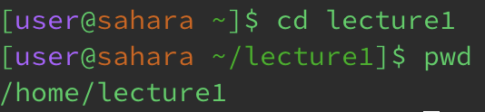
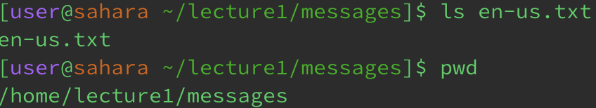

# Lab Report 1
---
This lab report consist of giving exmaples of `cd`, `ls` and `cat` in the following ways:
1. Share an example of using the command with no arguments.
2. Share an exmaple of using the command with a path to a directory as an argument.
3. Share an example of using the command with a path to a file as an argument.

## Examples with `cd`

This is an example of using the `cd` command without any arguments. As you can see there are no change in the path, as the directory has not changed. There was not an error, but there was no change in the path. 

The next image is an example of using `cd` command with a path to a directory as an argument. Here, we can see that the path now lists as "/lecture1". We can now interact with the files that are within the directory "lecture1".

The final image for the `cd` demonstrates what happens when trying to use a file as an argument. It gives an error because the file, in this case, "Hello.class" is not a directory. `cd` interacts with changing the path of directories, not files.

## Examples with `ls`

