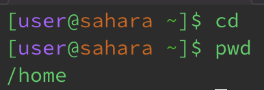
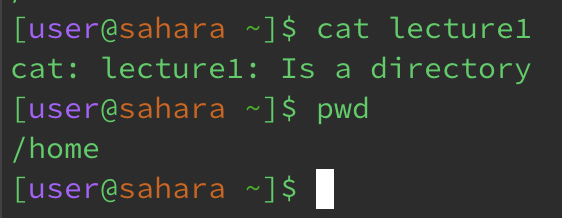

# Lab Report 1
---
This lab report consist of giving exmaples of `cd`, `ls` and `cat` in the following ways:
1. Share an example of using the command with no arguments.
2. Share an exmaple of using the command with a path to a directory as an argument.
3. Share an example of using the command with a path to a file as an argument.

## Examples with `cd`

This is an example of using the `cd` command without any arguments. As you can see there are no change in the path, as the directory has not changed. There was not an error, but there was no change in the path. This is because the `cd` command changes the current working directory, which in this case would be `/home`. And since we did not provide a relative path or an absolute path, `cd` doesn't perform it's intended function.

The next image is an example of using `cd` command with a path to a directory as an argument. Here, we can see that the path now lists as "/lecture1". We can now interact with the files that are within the directory "lecture1".

The final image for the `cd` demonstrates what happens when trying to use a file as an argument. It gives an error because the file, in this case, "Hello.class" is not a directory. `cd` interacts with changing the path of directories, not files.

## Examples with `ls`

`ls` in this situation shows all the directory in `/home`, which in this particular case only has "lecture1". `ls` is used to list all the directories in the path.

When adding a path to a directory as an arugment for the command `ls`, you can list out all the files that are within that directory. In this specific case, we were able to show what was in the directory "lecture1". The terminal showed us "Hello.class", Hello.java", "messages", and "README".

`ls` allows the user to see what is in the file of a given a path, however, if there is not anything within that file or directory, it will print out the entered arugment. In this particular case, since we are within the lecture1 directory and inputed "Hello.class" as the argument, the terminal printed "Hello.class" back to us. 

## Examples with `cat`

