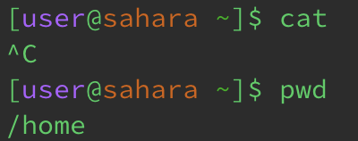
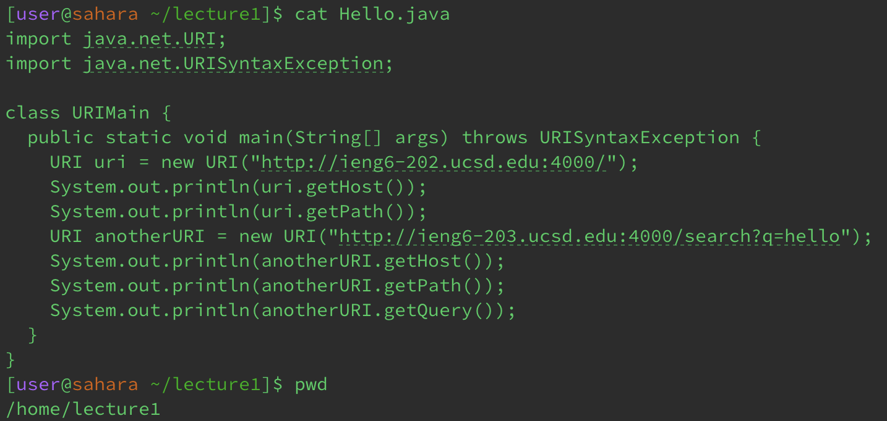

# Lab Report 1
---
This lab report consist of giving exmaples of `cd`, `ls` and `cat` in the following ways:
1. Share an example of using the command with no arguments.
2. Share an exmaple of using the command with a path to a directory as an argument.
3. Share an example of using the command with a path to a file as an argument.

## Examples with `cd`

Working Directory: /home

1. This is an example of using the `cd` command without any argument. The command `cd` means "change directory". Since we are already in the /home directory, there was no change in the working directory, however this may not always be the case. If were in a diffrent directory, and we used the `cd` command without any arugments, it would change the directory to the /home directory. The output we recieved was not an error. 

Working Directory: /home -> /lecture1 

2. The next image is an example of using `cd` command with a path to a directory as an argument. Here, we can see that the path now lists as "/lecture1". We can now interact with the files that are within the directory "lecture1". There was no error when running the `ls` command with a directory as an argument. 

Working Directory: /lecture1

3. The final image for the `cd` demonstrates what happens when trying to use a file as an argument. It gives an error because the file, in this case, "Hello.class" is not a directory. `cd` interacts with changing the path of directories, not files.

## Examples with `ls`

Working Directory: /home

1. `ls` in this situation shows all the directory in `/home`, which in this particular case only has "lecture1". The 'ls' command in general is used to show all the files within a directory or path. In other cases, there may be more files or directories within the given working directory. In those cases, there may be more displayed when running the command `ls`.

Working Directory: /home 

2. When adding a path to a directory as an arugment for the command `ls`, you can list out all the files that are within that directory. In this specific case, we were able to show what was in the directory "lecture1". The terminal showed us "Hello.class", Hello.java", "messages", and "README".

Working Directory: /lecture1

3. `ls` allows the user to see what is in the file of a given a path, however, if there is not anything within that file or directory, it will print out the entered arugment. In this particular case, since we are within the lecture1 directory and inputed "Hello.class" as the argument, the terminal printed "Hello.class" back to us. 

## Examples with `cat`

Working Directory: /home

1. When trying to use the `cat` command wihtout any files in the given path, it does not allow the terminal to recieve anymore commands. As seen in the picture above, there is the prompt is now longer present in the next line. Any input given in the terminal will just concatenate. This could be an infinite looping occuring.

Working Directory: /lecture1

2. Using `cat` with a directory as an arugment, causes the terminal to print out a statement that tells the user that the arugment entered is a directory. In the particular case above, the arugment was "messages" which is indeed a directory, this means that it cannot print out anything other than the fact that it is a directory. 

Working Directory: /lecture1

3. Inputing a file as an argument will cause the `cat` command to print out the contents of that file. For the image above, the arugment was the java file "Hello.java". The `cat` file would then print out the contents within that file. Another example would be using the `cat` command on the txt file "Hello.txt", it would print out "Hello World!".

